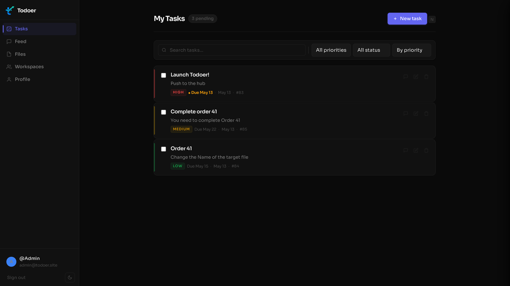

<!--
  If you have a logo, replace the placeholder below with:
  
  or an  tag pointing to your hosted image.
-->

<div align="center">


**An intentionally vulnerable full-stack task manager.**  
Built for ethical hackers who are done with toy labs.

[](#)
[](#)
[](#)
[](#)

</div>

---

## What is this?

Most practice labs feel like practice labs — labelled boxes, obvious hints, unrealistic setups. Todoer doesn't.

It's a real task management app: workspaces, file uploads, public feed, real-time collaboration over WebSockets, Google OAuth, email verification, password reset, and a separate admin panel. Enough attack surface to keep you busy. It also has real defences — CSRF protection, rate limiting, output sanitisation, JWT auth. Some of them work correctly. Some interact with the bugs in very interesting ways.

> There are no flags. No hints. No labels. Approach it like a real target.

<div align="center">
  
</div>

---

## The Stack

| Layer | Tech |
|---|---|
| Backend | Node.js + Express (3 services: app, admin, support chat) |
| Database | SQLite |
| Auth | JWT + cookies, Google OAuth, first-party OAuth server |
| Real-time | WebSocket |
| Frontend | Vanilla HTML/CSS/JS + client-side templating |
| File handling | `unzipper`, `tar-stream`, `multer` |
| Infrastructure | Docker + Docker Compose + nginx-proxy + Let's Encrypt |

---

## Vulnerability Categories

No specifics — go find them yourself. But in broad strokes:

- **XSS** — more than one kind, more than one location
- **File upload bugs**
- **Auth & OAuth issues**
- **IDOR and information disclosure**
- **Client-side attack chains** — require chaining multiple bugs together to land
- **Missing security controls** — gaps hiding in plain sight

> Some of the most interesting stuff doesn't work in isolation. The app has at least one multi-stage chain where every step feeds the next, using only information available from within the app itself.


## Installation

Todoer is built to run on a VPS with a real domain. It uses [nginx-proxy](https://github.com/nginx-proxy/nginx-proxy) and [acme-companion](https://github.com/nginx-proxy/acme-companion) to handle reverse proxying and automatic HTTPS — both the app and admin panel get TLS certs via Let's Encrypt, no manual cert work needed.

### Prerequisites

- Linux (Ubuntu 22.04+ recommended)
- Docker + Docker Compose — [install guide](https://docs.docker.com/engine/install/ubuntu/)
- A domain with **three** DNS A records pointing to your VPS:
  - `yourdomain.com` → VPS IP
  - `admin.yourdomain.com` → same VPS IP
  - `support.yourdomain.com` → same VPS IP

---

### Option 1: Guided Setup *(recommended)*

A setup script that walks you through everything interactively.

```bash
git clone https://github.com/Entit-y/Todoer
cd todoer
python3 setup.py
```

The script handles: checking prerequisites, collecting config values, generating `.env` and `docker-compose.override.yml`, launching containers, and waiting for TLS certificates to provision.

> **You still need to do these manually before running:**
> - Point your DNS A records to your VPS IP
> - Authenticate your sending domain in Brevo (Part A below)
> - Create a Google OAuth client and consent screen (the script will remind you)

#### Unattended install with a config file

For repeatable deployments, create a `KEY=VALUE` config file and pass it with `--config`:

```bash
python3 setup.py --config todoer.conf
```

Example config (`#` comments and blank lines are ignored):

```ini
DOMAIN=todoer.site
LE_EMAIL=you@example.com
BREVO_USER=user@smtp-brevo.com
BREVO_KEY=xsmtpsib-...
BREVO_FROM=noreply@todoer.site
GOOGLE_CLIENT_ID=....apps.googleusercontent.com
GOOGLE_CLIENT_SECRET=GOCSPX-...
ADMIN_USERNAME=admin
ADMIN_PASSWORD=yourpassword
```

If `ADMIN_USERNAME`/`ADMIN_PASSWORD` are omitted, random credentials are generated and printed once. Run `python3 setup.py --help` for the full list of required keys.

---

### Option 2: Manual Setup

#### 1. Clone the repo

```bash
git clone https://github.com/Entit-y/Todoer
cd todoer
```

#### 2. Create required directories

```bash
mkdir -p certs vhost.d html acme data uploads
```

#### 3. Configure environment variables

```bash
cp .env.example .env
nano .env
```

Three things to configure: **email (Brevo)**, **Google OAuth**, and **admin credentials**.

---

#### 📧 Email — Brevo SMTP

Todoer sends transactional emails for invite links, email verification, and password resets. It uses [Brevo](https://brevo.com/) (free tier: 300 emails/day).

**Do this in order — skipping Part A breaks delivery.**

**Part A: Authenticate Your Sending Domain**

Brevo can add DNS records automatically for most major providers (GoDaddy, Namecheap, Cloudflare, IONOS, OVHcloud, Hostinger, Squarespace, Wix, Gandi, Dynadot, and others).

1. Sign up at [brevo.com](https://app.brevo.com/account/register) — no credit card needed
2. Click your account name (top-right) → **Senders, Domains & IPs** → **Domains** tab
3. Click **Add a domain**, enter your domain, then choose **Authenticate automatically**
4. Log in to your domain provider when prompted — Brevo adds and verifies the DNS records for you

Once your domain shows **Authenticated**, move to Part B.

If your provider isn't supported, choose **Authenticate manually**. Brevo gives you three TXT records (Brevo Code, DKIM, and DMARC) to add yourself. Use [MXToolbox](https://mxtoolbox.com/) to check propagation while waiting.

**Part B: Get SMTP Credentials**

1. In Brevo, click the gear icon → **SMTP & API** → **SMTP** tab
2. Click **Generate a new SMTP key**, name it (e.g. `todoer`), hit Generate
3. **Copy the key immediately** — Brevo only shows it once

```env
BREVO_USER={random}@smtp-brevo.com   # shown under "Your SMTP Settings"
BREVO_KEY=xsmtpsib-...               # key you just generated
BREVO_FROM=noreply@yourdomain.com    # must match your verified domain
```

---

#### 🔑 Google OAuth

Powers the "Sign in with Google" button.

**Part 1: OAuth Consent Screen**

1. Go to [Google Cloud Console](https://console.cloud.google.com/) → create a new project
2. Navigate to **APIs & Services** → **OAuth consent screen**
3. Choose **External**, fill in app name + contact email, save through each step
4. For test use: keep status as **Testing** and add your Google email as a test user. For production: publish the app via the [Audience page](https://console.developers.google.com/auth/audience)

**Part 2: Client ID & Secret**

1. **APIs & Services** → **Credentials** → **Create Credentials** → **OAuth client ID**
2. Choose **Web application**, add your redirect URI: `https://yourdomain.com/auth/oauth/callback`
3. Copy the Client ID and Secret immediately

```env
GOOGLE_CLIENT_ID=...apps.googleusercontent.com
GOOGLE_CLIENT_SECRET=GOCSPX-...
GOOGLE_REDIRECT_URI=https://yourdomain.com/auth/oauth/callback
```

---

#### 🔒 Admin Credentials

```env
ADMIN_USERNAME=youradminusername
ADMIN_PASSWORD=somethingstronghere
```

Your completed `.env` should look like:

```env
BREVO_USER={random}@smtp-brevo.com
BREVO_KEY=xsmtpsib-...
BREVO_FROM=noreply@yourdomain.com
ADMIN_USERNAME=admin
ADMIN_PASSWORD=Password
GOOGLE_CLIENT_ID=....apps.googleusercontent.com
GOOGLE_CLIENT_SECRET=GOCSPX-...
GOOGLE_REDIRECT_URI=https://yourdomain.com/auth/oauth/callback
```

---

#### 4. Create docker-compose.override.yml

Instead of editing `docker-compose.yml` directly, create a `docker-compose.override.yml` with your domain. Docker Compose merges it automatically:

```yaml
services:
  app:
    environment:
      - VIRTUAL_HOST=yourdomain.com
      - LETSENCRYPT_HOST=yourdomain.com
      - LETSENCRYPT_EMAIL=you@example.com
      - APP_URL=https://yourdomain.com
      - SUPPORT_URL=https://support.yourdomain.com
  admin:
    environment:
      - VIRTUAL_HOST=admin.yourdomain.com
      - LETSENCRYPT_HOST=admin.yourdomain.com
      - LETSENCRYPT_EMAIL=you@example.com
  support:
    environment:
      - VIRTUAL_HOST=support.yourdomain.com
      - LETSENCRYPT_HOST=support.yourdomain.com
      - LETSENCRYPT_EMAIL=you@example.com
      - APP_URL=https://yourdomain.com
      - TODOER_APP_URL=https://yourdomain.com
      - SUPPORT_URL=https://support.yourdomain.com
  letsencrypt-companion:
    environment:
      - DEFAULT_EMAIL=you@example.com
```

#### 5. Launch

```bash
docker compose up -d --build
```

| Container | Role |
|---|---|
| `todoer-app` | Main app (port 3000, internal) |
| `todoer-admin` | Admin panel (port 3001, internal) |
| `todoer-support` | Support chat + help articles (port 3002, internal) |
| `nginx-proxy` | Reverse proxy, TLS termination (ports 80/443) |
| `nginx-proxy-acme` | Auto-provisions + renews Let's Encrypt certs |

Give acme-companion a minute or two on first boot to issue certificates. Then:

- App → `https://yourdomain.com`
- Admin → `https://admin.yourdomain.com`
- Support → `https://support.yourdomain.com`

#### 6. Verify

```bash
docker compose ps                         # all four containers should show "Up"
docker compose logs app                   # check for startup errors
docker compose logs nginx-proxy-acme      # check cert provisioning
```

#### Stopping & Resetting

```bash
# Stop containers
docker compose down

# Full reset — wipes DB and uploads
docker compose down -v
rm -f todoer.db
rm -rf uploads/*
```

---

## Project Structure

```
.
├── server.js                 ← main app server
├── docker-compose.yml
├── setup.py                  ← installation wizard
├── todoer.db                 ← SQLite database (auto-created on first run)
├── uploads/                  ← user-uploaded files (persisted via volume)
├── data/                     ← persistent data volume
├── certs/                    ← TLS certs (managed by acme-companion)
├── vhost.d/                  ← nginx vhost overrides (optional)
├── acme/                     ← acme.sh state
├── public/                   ← frontend
│   ├── home.html
│   ├── feed.html
│   ├── files.html
│   ├── workspaces.html
│   ├── invite.html
│   ├── profile.html
│   ├── vdp.html
│   ├── oauth-confirm.html
│   └── ...
├── admin/                    ← separate admin panel service
│   ├── server.js
│   └── public/
└── support/                  ← support chat + help articles service
    ├── server.js
    └── public/
        ├── articles/         ← knowledge base articles
        ├── chat.html
        ├── login.html
        ├── status.html
        └── ...
```

---

## Nimbus Vault

<a href="https://nimbusvault.app/">
  
</a>

Todoer is the official practice environment for **[Nimbus Vault](https://nimbusvault.app/)** — a security research tool built for bug bounty hunters. Use it to learn the platform, test your playbooks, and sharpen your approach before going live. Safe, legal, and realistic.

---

<div align="center">

Enumerate. Map the surface. Look for what doesn't fit.  
Think about what happens when you combine what you find.

</div>